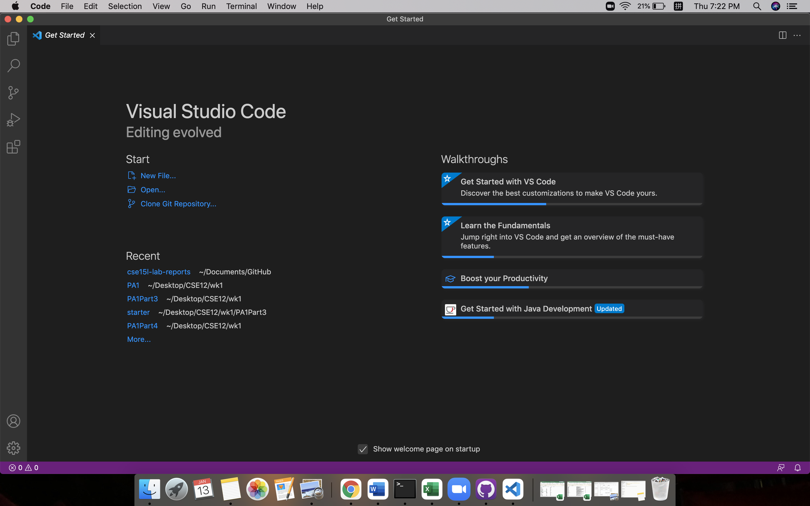
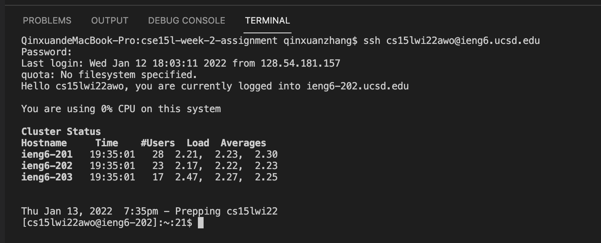
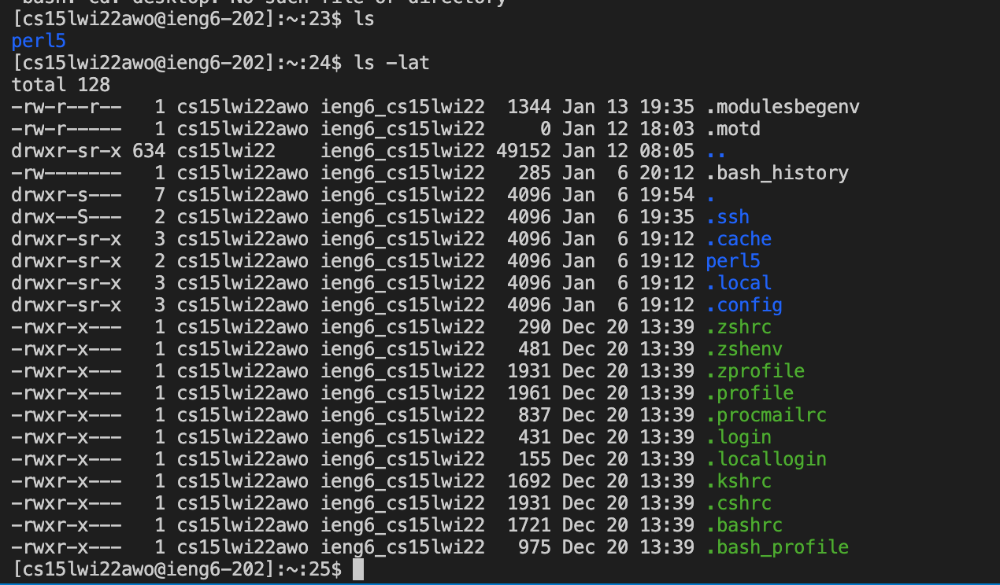
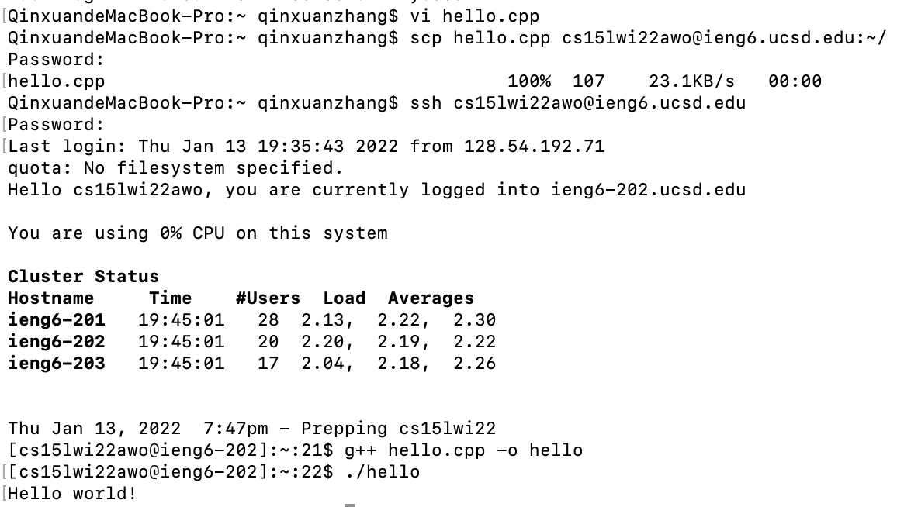
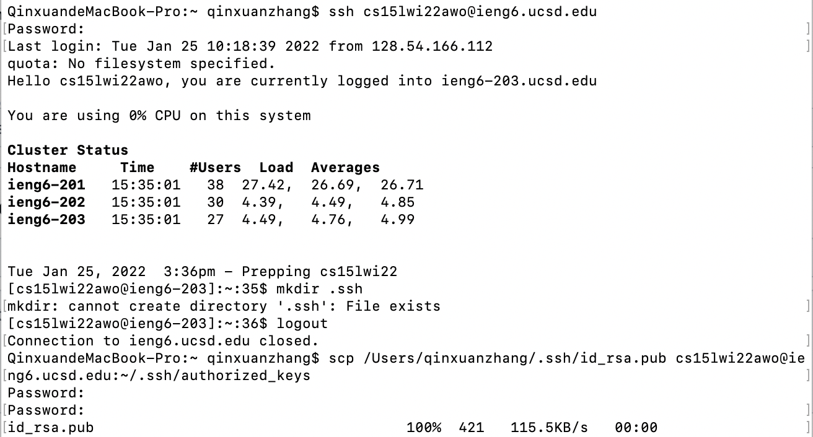

This page is updated using [Visual Studio Code](https://code.visualstudio.com/).

## Step1: 

- install the vscode from the website
- get started

## Step2:

- log in to my CSE15L account on ieng6
- need to change passward for the first log-in to activate the account

## Step3:

- command `ls` lists the contents of the current directory
- command `ls -lat` lists the contents, including the hidden files in the long format

## Step4:

- use command "scp" to move the c++ source file "hello.cpp" to my ieng6 account
- the file can be compiled and runned after being moved

## Step5:

- use command "ssh-keygen" creates a pair of files called the public key and private key stored in the server and client respectively

- copy the public (not the private) key to the .ssh directory of your user account on the server

## Step6:

- write the command `ls` in quotes at the end of an ssh command 
- it can be directly run on the remote server, then exit as the keystroke is set

