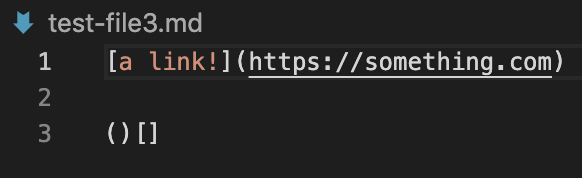

# lab report 2

## Change1

Problem: undesired test case design 
Symptom: unexpected output

## Change2

- test file for a failure-inducing input: 
test-file3

symptom & changes: fixed double output and saved files so we don’t get empty link lists

## Change3

Problem: deplicated commands 
Symptom: compilation and running errors of the codes

## some remarks:
- in fact, my group did not strictly make three changes to the code 

## relationship between the bug, the symptom, and the failure-inducing input:

failure - inducing input : an input or a test-case which causes your code to fail (i.e. exception (compile time, runtime) or cause nonsensical output) 
symptom : is a problem/ an outcome different from the expected 
Symptoms can be the same but have different causes : you can get similar problems or output, but it is caused by a different bug. 
